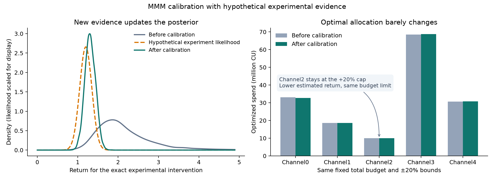
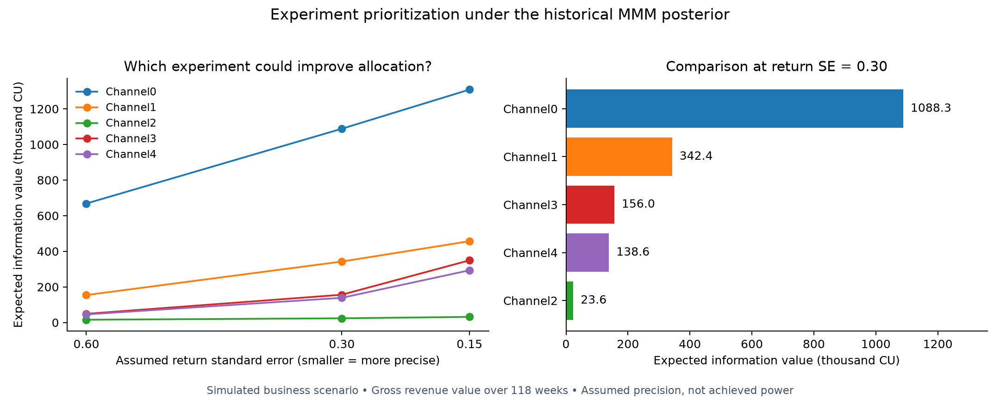

# Bayesian Marketing Mix Modeling: From Measurement to Budget Decisions

An end-to-end portfolio project connecting **hierarchical Bayesian estimation, predictive validation, incremental channel effects, budget optimization, and experimental calibration**.

**Business question:** With a fixed advertising budget, how should spending move across five channels—and how should that decision change when new evidence arrives?

> This is an independent project using Google Meridian's **simulated** data. The model is a custom NumPyro implementation, not Meridian itself. Experimental calibration uses an explicitly **hypothetical** summary. No real advertiser results or realized revenue lift are claimed.

## Results at a glance

| Question | Result |
|---|---|
| Does the model predict better than a simple baseline? | Before experimental calibration, posterior holdout RMSE improves **7.9%** over regional historical means; improvement occurs in **27/40** regions. |
| Is predictive uncertainty calibrated? | **88.2%** empirical coverage for nominal 90% intervals. |
| What does the first allocation predict? | **2.64m** additional revenue units, with 90% credible interval **[−1.66m, 6.84m]**. |
| Does experimental information update beliefs? | Same-intervention return changes from **2.14 [1.34, 3.53]** to **1.31 [1.10, 1.53]** after calibration with hypothetical evidence. |
| Does updated evidence necessarily reverse the decision? | No. Channel2's historical marginal ROAS falls from **2.02 to 1.35**, but its recommended increase stays at the **+20% bound**. |

Intervals above are model-conditional. Revenue is not profit; the source does not specify a currency. The allocation scenario uses a fixed total budget and ±20% channel bounds.



Calibration lowers the estimated return and narrows uncertainty, while the optimal allocation barely changes under the current constraints: Channel2 remains at its +20% spending cap before and after calibration.

## Read the project in three notebooks

| Notebook | Analytical focus |
|---|---|
| [01 — Model and validation](notebooks/01_model_and_validation.ipynb) | Partial pooling, adstock and saturation, MCMC diagnostics, and chronological holdout evaluation. |
| [02 — Channel effects and budget](notebooks/02_channel_effects_and_budget.ipynb) | Counterfactual effect definitions, ROAS versus marginal ROAS, and one allocation evaluated across posterior draws. |
| [03 — Experimental calibration](notebooks/03_experimental_calibration.ipynb) | Add independent evidence to the likelihood, refit, recompute effects, and compare updated decisions. |

For a business-facing read, start with the [decision memo](docs/decision_memo.md). For technical detail, see the [model specification](docs/model_specification.md) and [methodology and limitations](docs/methodology.md).

## Extension: which experiment is worth running next?

Before observing any new evidence, compare **five single-channel +20% interventions at three assumed precision levels**. Starting from the historical-data posterior, integrate over possible experimental summaries, update beliefs and re-optimize the same fixed-budget decision.

At return SE **0.30**, gross expected information value is approximately **1.088m CU for Channel0**, compared with **0.024m CU for Channel2**, over the existing **118-week historical scenario**. Channel2 has the most uncertain experimental return, yet its spending recommendation usually remains at the +20% cap. In this candidate set, greater uncertainty does not necessarily imply greater decision value.



These are model-conditional revenue values before experiment costs, not forecast cash returns. Precision is assumed, and finite-posterior sensitivity matters—particularly for small values and rare experimental results. See the [candidate results](reports/experiment_prioritization/results.md) and [design, computation and limitations](docs/experiment_prioritization.md). The extension is motivated by [Abadie et al., Estimating the Value of Evidence-Based Decision Making](https://arxiv.org/abs/2306.13681); it is a Bayesian MMM information-value analysis, not a replication of their empirical Bayes method.

The Channel0 follow-up compares **−20%, +10%, and +20%** interventions at equal assumed revenue-measurement noise. At revenue SE 118.9k CU, information values are **1.136m, 0.685m, and 1.088m CU**, respectively. The spending cut has only a modest information-value lead over +20% and also produces an expected test-period revenue loss. See the [intensity comparison and economic tradeoffs](reports/channel0_designs/results.md); this is not a net-value recommendation to cut spending.

## Model and evaluation

The data contain 40 regions × 156 weeks. The model uses hierarchical regional intercepts and positive media coefficients, channel-specific geometric adstock and Hill saturation, time effects, and adjustment covariates. It is fitted with NumPyro NUTS.

The first 130 weeks form the training period; the initial 12 history weeks are excluded from the likelihood. The final 26 weeks are held out. Scales are estimated on training data only. Holdout predictions use actual contemporaneous inputs, so this is **conditional prediction**, not an unconditional forecast.

Both saved fits use four chains with 1,000 retained draws per chain. Both have zero divergences and maximum R-hat below 1.01. Prediction and sampler checks do not establish causal identification.

## Reproduce

The three notebooks read small result snapshots already in the repository. You can inspect their executed outputs on GitHub without downloading data or refitting.

For local execution, use **Python 3.12**:

```bash
python3.12 -m venv .venv
source .venv/bin/activate
python -m pip install -r requirements.txt
python src/execute_walkthroughs.py
python src/validate_release.py
```

To rebuild the complete analysis:

```bash
python reproduce.py --dry-run
python reproduce.py --run-name my-reproduction
```

This downloads and checksums the source data, fits both models, evaluates the candidate experiments, recreates reports, and executes the notebooks in a **new `runs/my-reproduction/` directory**. It does not overwrite published snapshots. Raw data and large posterior arrays are intentionally excluded from the repository. Refitting takes several minutes per model and depends on hardware. Numerical results can differ across platforms and library builds.

If you already have the verified source CSV, use `--local-data /path/to/geo_all_channels.csv`. See [data provenance](docs/data_provenance.md) for the source and SHA-256. Dependencies are pinned to the tested environment; the local reproduction target was Python 3.12 on macOS/CPU.

## Assumptions, limitations, and open questions

### Assumptions behind the estimates

- **Causal adjustment:** Interpreting channel contributions as incremental effects requires adequate control of common causes of media exposure and conversions. The model treats sentiment, organic exposure and other controls as valid adjustment variables. Their inclusion does not establish exogeneity: sentiment survey timing is undocumented, and sentiment or organic exposure could be consequences of paid advertising. Holding such variables fixed could exclude mediated effects.
- **Response structure and pooling:** Paid media effects are positive, additive and stable over time, with no channel interactions or regional spillovers. Regional intercepts and media coefficients are exchangeable within their hierarchies. Each channel shares one decay and half-saturation parameter across regions; geometric adstock ends at lag 12, and the Hill slope is fixed at one.
- **Observation model and priors:** Errors are conditionally independent Gaussian draws with a common standard deviation on the scaled per-capita outcome. This excludes residual serial correlation and region-specific noise scales. Priors are working assumptions, and outcome scaling uses training data; prior predictive checks are therefore not wholly data-independent.
- **Experimental evidence:** Calibration assumes an independent, unbiased experimental summary for the exact intervention being modeled, with a Normal likelihood and known standard error. The return of **1.20 with SE 0.15** is hypothetical. Neither that precision nor independence has been established by a real experiment.
- **Budget response:** Optimization assumes spend translates proportionally into impressions at fixed prices, conversion values remain fixed, and historical regional and weekly spending patterns persist within each channel. It maximizes expected in-window revenue under a fixed total budget and ±20% channel bounds; it excludes profit margins, implementation costs and effects after the reporting window.

### Limitations visible in the current results

| Finding | What it limits |
|---|---|
| The historical-data **MCMC posterior, before experimental calibration**, improves holdout RMSE by **7.9%**, but beats regional historical means in only **27/40 regions**. | Predictive gains are modest and uneven; the other 13 regions do not benefit on this metric. Successful sampling does not imply a sufficient model specification. |
| Nominal 90% predictive intervals cover **88.2%** of holdout outcomes. | Coverage is below nominal in this split. This descriptive result alone does not establish systematic miscalibration; dependence across observations and variation by region and time need examination. |
| About **0.10%** of holdout posterior predictive draws are negative. | The Gaussian likelihood assigns some probability to impossible conversions, even after fitting. |
| After hypothetical calibration, the proposed reallocation has expected revenue gain **1.43m**, with a 90% credible interval of **[−2.52m, 5.13m]**. | A positive expected gain is compatible with losses. The allocation maximizes the stated objective, but is not a reliably positive or verified future business outcome. |
| Channel2 remains at the **+20% bound** after its estimated marginal ROAS falls. | The recommendation depends on relative channel returns and constraints. An unchanged allocation does not mean the experiment supplied no information or that spending beyond the bound is justified. |

The holdout covers one 26-week period in the same 40 regions and uses actual contemporaneous inputs. It tests conditional prediction, not advance forecasting, performance in new regions, or causal attribution. The reported holdout metrics have **not** been recomputed for the experimentally calibrated posterior.

All observations are simulated. The earlier experiment-design simulations did not reach the targeted power for the tested decision scenarios; the hypothetical calibration summary does not resolve that feasibility gap. See [exploration notes](docs/exploration_notes.md). One intervention-specific summary also cannot separately identify decay, saturation and response amplitude, or validate other channels and spending levels. Reported intervals condition on the chosen model and omit uncertainty from unmeasured confounding, model selection and future input changes.

### Open questions and next iterations

1. **Why does the model lose to historical means in 13 regions?** Build on the regional error audit to compare temporal bias, residual autocorrelation and the effects of pooling. Test targeted alternatives—such as regional time effects or noise scales—against the current model and simple baselines. These are candidate explanations, not established causes.
2. **Are uncertainty and outcome support adequately modeled?** Compare interval coverage and width across regions and time, and assess a likelihood or link that respects nonnegative outcomes. Judge changes by predictive performance and uncertainty calibration, rather than merely eliminating negative draws.
3. **How sensitive are channel effects and allocations to specification?** Vary defensible priors, sentiment and organic adjustment, lag length and saturation structure. Check whether channel rankings and budget recommendations remain stable. Obtain measurement timing before making stronger causal claims.
4. **What experimental evidence is both feasible and decision-relevant?** Establish an achievable standard error for a specified budget intervention, then replace the hypothetical summary with independently measured lift. Assess compatibility with the historical model and which response parameters remain weakly identified.
5. **Does calibration improve decisions beyond this scenario?** Evaluate conditional prediction under the calibrated posterior, and compare allocations under alternative prices, margins, constraints and downside-risk objectives. Reassess the recommendation using the same posterior for all candidate policies.

Model revisions motivated by the current holdout must treat it as a validation set. Use rolling temporal validation for development and reserve a new untouched period, when available, for the next final evaluation. The questions above are proposed follow-up work, not completed robustness checks.

## Repository map

```text
notebooks/       Three executed analytical narratives
src/             Estimation, evaluation, optimization and calibration code
docs/            Decision memo, assumptions and provenance
reports/         Small saved tables, diagnostics and figures
data/            Hypothetical evidence summary; source CSV excluded
reproduce.py     Full pipeline in a fresh run directory
```
